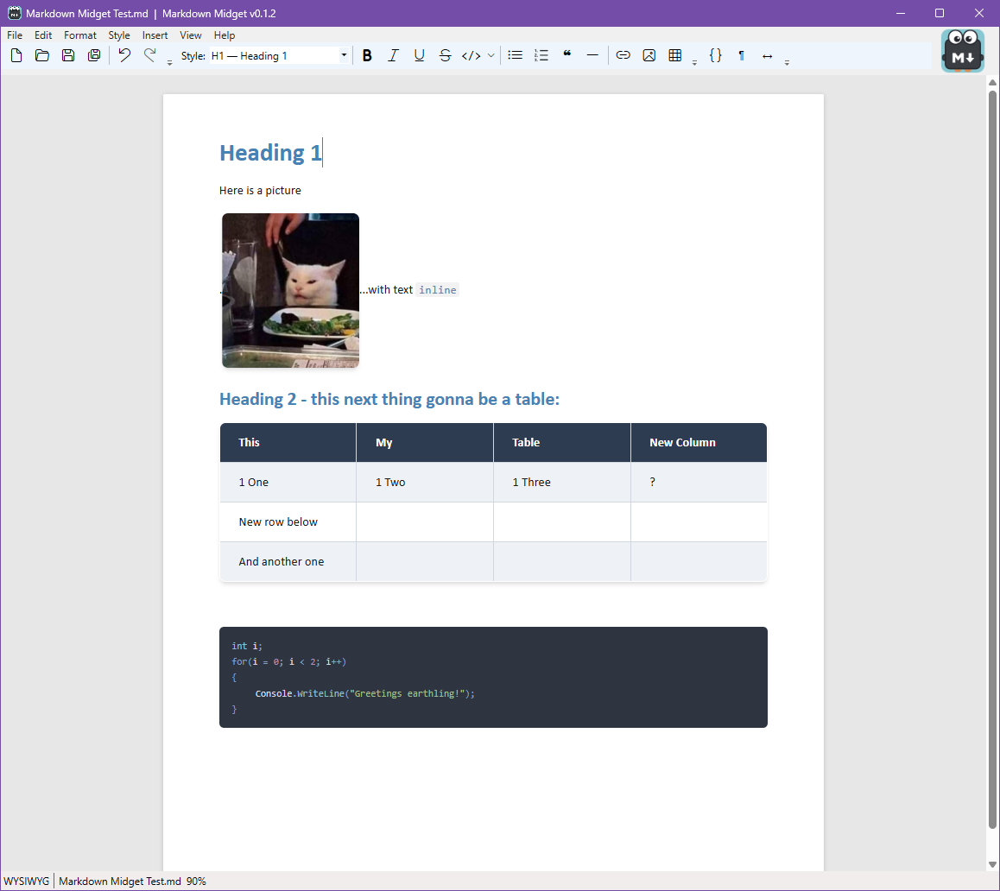

# Markdown Midget


A WYSIWYG markdown editor for Windows, modeled on WordPad's behaviors, menus,
toolbar, and keyboard shortcuts — but with **markdown as the native (and only)
format**. The default surface is a Word-like WYSIWYG editor; a toggle switches to
raw-markdown source editing.

Built on **.NET / WPF** hosting a **WebView2** control. The editing surface is
[Milkdown](https://milkdown.dev/) (a ProseMirror-based WYSIWYG markdown editor),
so markdown is the literal document model rather than a lossy import/export.



## Features

- **WYSIWYG editing** with a one-key toggle to the raw **markdown source** (Ctrl+E).
- Headings, **bold / italic / underline / strikethrough**, inline code, bulleted &
  numbered lists, block quotes, and horizontal rules.
- **Tables** (GFM) — insert dialog plus a native right-click menu for
  insert/delete/select column, row, or table; styled with a dark header and
  alternating rows.
- **Pictures** embedded as data URIs (travel with the file), with an aspect-locked
  **Resize** dialog.
- **Links** rendered like a browser, with the URL as a hover tooltip.
- **Fenced code blocks** with syntax highlighting (C#, JavaScript, TypeScript,
  HTML, CSS).
- **Formatting marks** toggle (¶ / ↵ / →) and **spell check**.
- **Document width** (Portrait / Landscape / Full, remembered between sessions) and
  a **zoom** indicator (Ctrl + mouse wheel).
- **Recent files**, drag-and-drop to open, **read-only** mode, and a bundled Help
  document.
- Ships as a **single `.exe`**.

## Requirements

- **Windows 10/11** and the Microsoft Edge **WebView2 runtime** (already present on
  Windows 11; otherwise a free download from Microsoft).
- The framework-dependent build also needs the **.NET Desktop runtime**; the
  self-contained build bundles it. See [Distribution](#distribution-single-file-builds).

## Status

Alpha (v0.1.x). Windows-only for now; the editor core is web-based so a
cross-platform shell (MAUI/Avalonia) is a realistic future step.

## Layout

```
MarkdownMidget.sln
src/MarkdownMidget/         WPF app (net10.0-windows)
  MainWindow.xaml(.cs)      Menu, toolbar, WebView2 host, source toggle, file I/O
  wwwroot/                  Built editor bundle (served to WebView2) — generated
editor-src/                 npm/esbuild project that bundles Milkdown -> wwwroot
  src/main.js               Editor setup + the window.MDM host bridge
  build.mjs                 esbuild bundler
```

### Host ↔ editor bridge (`window.MDM`)

- `create(initialMarkdown)` — mount the editor with a document
- `getMarkdown()` / `setMarkdown(md)` — used for file I/O and the source toggle
- `cmd(name, …args)` — run a formatting command (`bold`, `italic`, `underline`,
  `strike`, `code`, `h1`..`h6`, `paragraph`, `bullet`, `ordered`, `quote`, `hr`,
  `codeblock` (language))
- `insertMarkdown(md)` — insert a fragment (used by the link/picture helpers)

The editor posts `loaded` / `ready` / `change` messages back to the WPF host.
Headings `Ctrl+1`..`Ctrl+5` / `Ctrl+0` (paragraph) are bound in the editor keymap
so they work while typing in WYSIWYG; the same commands also work in the raw
source view via the WPF shell ([SourceFormat.cs](src/MarkdownMidget/SourceFormat.cs)).
Fenced code blocks are syntax-highlighted (Prism/refractor) for C#, JavaScript,
TypeScript, HTML, and CSS.

The editor bundle is **embedded in the assembly** and extracted to
`%LocalAppData%\MarkdownMidget\editor` at startup, so a self-contained publish is
a single `.exe` rather than an exe plus a loose `wwwroot` folder.

### Underline

Markdown has no underline, so it round-trips as inline HTML `<u>…</u>`
([editor-src/src/underline.js](editor-src/src/underline.js)): a custom Milkdown
mark serializes to `<u>`, and a remark transform collapses the `<u> … </u>`
inline-HTML pair back into the mark on load.

## Build & run

The editor bundle is checked in, so the app builds directly:

```sh
dotnet run --project src/MarkdownMidget
```

After changing anything under `editor-src/`, rebuild the bundle:

```sh
cd editor-src
npm install      # first time only
npm run build    # writes src/MarkdownMidget/wwwroot/editor.bundle.{js,css}
```

`npm run watch` rebuilds on change during development.

## Distribution (single-file builds)

The **framework-dependent** profile is the standard distributable — a single ~3 MB
`.exe` for machines that have the **.NET 10 Desktop runtime** (and the Edge
**WebView2 runtime**, which ships with Windows 11):

```sh
dotnet publish src/MarkdownMidget -p:PublishProfile=win-x64-fxdependent
# -> src/MarkdownMidget/bin/Release/publish/framework-dependent/MarkdownMidget.exe
```

A fully **self-contained** profile (`win-x64`, ~63 MB, bundles the .NET runtime so
nothing needs to be installed) also exists for one-off use; it can't be shrunk
because WPF doesn't support trimming. The editor bundle and HELP.md are embedded
in either build. Debug/`dotnet run` stay framework-dependent and fast.

## Icon / mascot

The mascot (`art/midget.svg`) is the canonical Markdown `M▼` badge with googly
eyes and stubby feet, in the editor's Nord palette. `art/` holds rendered PNGs
(16–256 px) and a multi-resolution `midget.ico` used as the app/taskbar icon
(`<ApplicationIcon>`), the title-bar icon, and the toolbar mark. Regenerate with
ImageMagick:

```sh
cd art
for s in 16 24 32 48 64 128 256; do magick -background none -density 512 midget.svg -resize ${s}x${s} midget-${s}.png; done
magick -background none -density 512 midget.svg -define icon:auto-resize=256,128,64,48,32,24,16 midget.ico
```

## Keyboard shortcuts (WordPad-aligned)

| Action            | Shortcut       |
| ----------------- | -------------- |
| New               | Ctrl+N         |
| Open              | Ctrl+O         |
| Save              | Ctrl+S         |
| Save As           | Ctrl+Shift+S   |
| Bold / Italic / Underline | Ctrl+B / Ctrl+I / Ctrl+U (in the editor) |
| Paragraph / Heading 1–5 | Ctrl+0 / Ctrl+1 … Ctrl+5 |
| Focus style box   | Ctrl+Shift+H   |
| Insert link       | Ctrl+K         |
| Exit block (escape a code block) | Ctrl+Enter |
| Toggle source     | Ctrl+E         |

## MVP scope notes

Per the project rule, anything from WordPad that isn't strictly easy to implement
is deferred from this first iteration. Notable deferrals / divergences:

- **Ribbon → menu + toolbar.** WPF has no trivial Office ribbon, so the MVP uses
  a classic menu bar + toolbar with the same commands and shortcuts.
- **Font size box → paragraph Style dropdown.** Markdown styles blocks
  (Paragraph / Heading 1–5 / code block), not point sizes — the "Styles, not size"
  divergence.
- **Underline → inline HTML.** Markdown has no underline; it round-trips as
  `<u>…</u>` (see above).
- **Toolbar glyphs.** Old-school flat icon buttons (Segoe Fluent Icons). The
  `</>` mark is reserved for inline code; the source/WYSIWYG toggle uses braces
  (`{}`, → markdown source) and a document glyph (→ formatted view).
- **Pictures embed as data URIs.** Inserting a picture base64-encodes the file
  into the markdown (``) so it renders inside the
  sandboxed WebView and travels with the document. Right-click ▸ **Resize…**
  (aspect-locked) stores the size as inline HTML ``.
- **Links** render styled (steelblue, underlined) with the URL shown as a native
  hover tooltip (a `title`-attribute decoration), like a browser.
- **Tables** (GFM): insert via Insert ▸ Table…; right-click for the minimal
  structure edits (insert/delete/select column, row, table). Cell selection +
  Backspace/Delete clears content; typing replaces it. Styled like the Markdown
  Monster "PDF Output" theme — dark header row, alternating row stripes.
- **Modified state is content-based:** the document is "unchanged" whenever it
  matches the last opened/saved markdown, so undoing back to that state clears the
  modified flag. Opening/new flushes undo history (you can't undo past the open
  state); saving leaves history intact (you can undo past a save).
- **Drag & drop:** dropping a file opens it in place when the window holds an
  untitled, unmodified document; otherwise it opens in a new instance. Files can
  also be passed on the command line.
- **Read-only mode:** Edit ▸ Read Only locks the document; also available via the
  `--readonly` command-line switch. Help ▸ View Help opens the bundled
  [HELP.md](HELP.md) read-only in a new instance.
- Deferred: print, page setup, find/replace, color, theming.

## License

[MIT](LICENSE) © Funcular Labs.

The bundled editor is built on [Milkdown](https://milkdown.dev/) /
[ProseMirror](https://prosemirror.net/) with syntax highlighting via
[Prism](https://prismjs.com/) / [refractor](https://github.com/wooorm/refractor),
each under their own permissive licenses.
